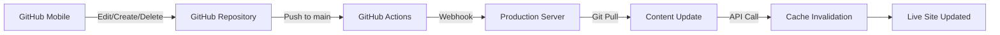

# 블로그 시스템 인프라 구성도

## 🏗️ 전체 아키텍처 개요

본 블로그는 **완전 자동화된 모바일 퍼스트 블로깅 시스템**으로, GitHub Mobile을 통한 컨텐츠 작성부터 프로덕션 배포까지 모든 과정이 자동화되어 있습니다.

```
┌─────────────────┐    ┌──────────────────┐    ┌─────────────────┐
│   GitHub Mobile │────│  GitHub Actions  │────│  Production     │
│   (Content)     │    │  (CI/CD)         │    │  Server         │
└─────────────────┘    └──────────────────┘    └─────────────────┘
         │                        │                       │
         │                        │                       │
         ▼                        ▼                       ▼
   📝 Markdown                🔄 Automated              🚀 Live Site
   파일 작성/수정             Webhook Trigger           실시간 반영
```

---

## 📱 프론트엔드 (Next.js 14)

### 🔧 핵심 기술 스택
- **프레임워크**: Next.js 14.2.30 (App Router)
- **언어**: TypeScript
- **스타일링**: Tailwind CSS
- **폰트**: Noto Sans KR (Google Fonts)
- **테마**: next-themes (다크모드 지원)
- **배포 모드**: Static Site Generation (SSG) + ISR

### 📋 주요 기능
- **ISR (Incremental Static Regeneration)**: 1분 간격 자동 재검증
- **다크모드 지원**: 시스템 설정 자동 감지
- **반응형 디자인**: 모바일 우선 설계
- **SEO 최적화**: 메타태그, 사이트맵 자동 생성
- **페이지 전환 애니메이션**: 부드러운 UX

### 🗂️ 디렉토리 구조
```
app/
├── layout.tsx              # 루트 레이아웃
├── page.tsx               # 메인 페이지 (블로그 홈)
├── globals.css            # 전역 스타일
├── api/                   # API Routes
│   ├── revalidate/        # 캐시 무효화 API
│   ├── authors/           # 작성자 정보 API
│   ├── posts/             # 포스트 조회 API
│   └── tags/              # 태그 조회 API
├── article/[slug]/        # 개별 아티클 페이지
├── articles/              # 아티클 목록 페이지
├── post/[slug]/           # 개별 포스트 페이지
├── docs/                  # 문서 페이지
├── sitemap.xml/           # 사이트맵 생성
└── components/            # 재사용 컴포넌트들
```

---

## 🐳 백엔드 인프라 (Docker + Node.js)

### 🔧 컨테이너 구성
```yaml
# docker-compose.yml
services:
  web:           # Next.js 애플리케이션
    - 포트: 3000 (호스트에 노출)
    - 환경: Production
    - 볼륨: ./content:/app/content
  
  redis:         # 캐싱 서버
    - 이미지: redis:7-alpine
    - 영속성: AOF 활성화
    - 포트: 6379 (내부 네트워크)
  
  caddy:         # 리버스 프록시 & HTTPS
    - 포트: 80, 443
    - SSL: 자동 인증서 발급
    - 설정: Caddyfile
```

### 🗄️ 데이터 저장소
- **컨텐츠 파일**: `/content` 디렉토리 (마크다운)
- **캐시**: Redis (포스트 메타데이터, 태그 정보)
- **이미지**: Google Cloud Storage + CDN (img.greedient.kr)

---

## 🔄 CI/CD 자동화 파이프라인

### 📱 GitHub Mobile → 🚀 Production



### 🔧 GitHub Actions 워크플로우
**파일**: `.github/workflows/revalidate-content.yml`

```yaml
트리거 조건:
  - 브랜치: main
  - 경로: content/posts/**/*.md, content/pages/**/*.md
  - 수동 실행: workflow_dispatch

실행 단계:
  1. 변경된 파일 감지 (추가/수정/삭제)
  2. jq 설치 및 페이로드 생성
  3. HMAC 서명 생성
  4. 웹훅 전송 (포트 8080)
  5. 배포 상태 요약
```

### 🎯 웹훅 시스템
**호스트 기반 웹훅 리스너**
- **파일**: `webhook-listener.sh` + `webhook_server.py`
- **서비스**: systemd (`webhook-listener.service`)
- **포트**: 8080
- **기능**:
  - Git pull 자동 실행
  - 캐시 무효화 API 호출
  - 상세 로깅 및 에러 처리

---

## 🔒 보안 & 인증

### 🔐 API 보안
- **웹훅 서명**: HMAC-SHA256 검증
- **캐시 무효화**: Secret 토큰 기반 인증
- **HTTPS**: Caddy 자동 SSL 인증서

### 🛡️ 환경 변수
```bash
# .env (Production)
REDIS_HOST=redis
REDIS_PORT=6379
NODE_ENV=production
REVALIDATE_SECRET=***

# webhook-listener.env
WEBHOOK_PORT=8080
WEBHOOK_SECRET=***
PROJECT_DIR=/home/ubuntu/myblog
REVALIDATE_TOKEN=***
```

---

## 🚀 배포 환경

### 🖥️ 서버 사양
- **클라우드 제공업체**: Oracle Cloud Infrastructure (OCI)
- **OS**: Ubuntu Server
- **Docker**: docker-compose 기반 컨테이너 오케스트레이션
- **웹서버**: Caddy (리버스 프록시 + HTTPS)
- **도메인**: greedient.kr
- **CDN 도메인**: img.greedient.kr (A레코드)

### 📊 모니터링 & 로깅
- **시스템 로그**: systemd journal (`webhook-listener`)
- **애플리케이션 로그**: Docker 컨테이너 로그
- **캐시 상태**: Redis 메모리 사용량
- **배포 상태**: GitHub Actions 실행 결과

---

## ☁️ 클라우드 인프라

### 🌐 Google Cloud Platform (GCP)
- **Storage**: Google Cloud Storage (US 리전)
- **CDN**: Cloud CDN (글로벌 엣지 로케이션)
- **Functions**: Cloud Functions (이미지 최적화 트리거)

### 🏛️ Oracle Cloud Infrastructure (OCI)
- **Compute**: VM Instance (Ubuntu Server)
- **Network**: Virtual Cloud Network (VCN)
- **DNS**: A레코드 설정 (greedient.kr, img.greedient.kr)

### 🖼️ 미디어 최적화 파이프라인
```
┌─────────────────┐    ┌──────────────────┐    ┌─────────────────┐
│  원본 이미지     │────│  Cloud Functions │────│  최적화 이미지   │
│  (GCS Upload)   │    │  (Auto Trigger)  │    │  (WebP 변환)    │
└─────────────────┘    └──────────────────┘    └─────────────────┘
         │                        │                       │
         │                        │                       │
         ▼                        ▼                       ▼
   📁 /original/              🔄 WebP 변환              📁 /optimized/
   고해상도 원본              자동 리사이징              웹 최적화 이미지
```

### 🚀 CDN 최적화
- **글로벌 배포**: US 리전 → 전세계 엣지 캐시
- **한국 성능**: CDN 엣지 서버를 통한 최고 수준 응답속도
- **캐시 전략**: 이미지 파일 장기 캐싱 (1년)
- **압축**: WebP 자동 변환으로 대역폭 절약

---

## 🔄 캐시 전략

### 📈 다층 캐싱 구조
```
┌─────────────────┐
│   Browser       │ ← 브라우저 캐싱
├─────────────────┤
│   Cloud CDN     │ ← GCP CDN (이미지, 전세계)
├─────────────────┤
│   Next.js ISR   │ ← 페이지 캐싱 (1분)
├─────────────────┤
│   Redis Cache   │ ← 데이터 캐싱 (OCI)
├─────────────────┤
│   GCS Storage   │ ← 원본 저장소 (US)
└─────────────────┘
```

### ⚡ 캐시 무효화
1. **Git pull 완료** → API 호출
2. **Redis 캐시 클리어** (패턴: `markdown:posts:*`)
3. **Next.js 캐시 무효화** (`/`, `/articles`)
4. **ISR 재생성** (백그라운드)

---

## 📝 컨텐츠 관리

### 📂 파일 구조
```
content/
├── posts/           # 블로그 포스트
│   ├── post1.md
│   └── post2.md
└── pages/           # 정적 페이지
    └── about.md
```

### 📋 마크다운 메타데이터
```yaml
---
title: "포스트 제목"
slug: "post-slug"
excerpt: "포스트 요약"
feature_image: "https://img.greedient.kr/..."
published_at: "2024-01-30T16:00:00.000Z"
tags: ["tag1", "tag2"]
author: "작성자"
draft: false
---
```

### 🏷️ 태그 시스템
- **동적 태그 생성**: 마크다운에서 자동 추출
- **카테고리 필터링**: 'main', 'article', 'blog' 태그 기반
- **SEO 최적화**: 태그별 개별 페이지 생성

---

## 🔧 개발 도구 & 설정

### 📦 주요 Dependencies
```json
{
  "next": "14.2.30",
  "react": "^18",
  "typescript": "^5",
  "tailwindcss": "^3.4.1",
  "next-themes": "^0.3.0",
  "gray-matter": "^4.0.3",
  "marked": "^12.0.1",
  "ioredis": "^5.3.2"
}
```

### ⚙️ 빌드 설정
- **TypeScript**: 엄격 모드
- **Tailwind**: JIT 컴파일
- **Next.js**: Standalone 출력 (Docker 최적화)
- **이미지 최적화**: next/image (외부 도메인 허용)

---

## 🚦 성능 최적화

### ⚡ 로딩 성능
- **이미지**: Google Cloud Storage + CDN (WebP 자동 최적화)
- **폰트**: Google Fonts 프리로드
- **CSS**: Tailwind CSS 퍼지
- **JavaScript**: Next.js 자동 번들 분할

### 📊 SEO 최적화
- **메타태그**: 동적 생성
- **사이트맵**: 자동 생성 (`/sitemap.xml`)
- **구조화 데이터**: JSON-LD
- **페이지 속도**: ISR + CDN

---

## 🔄 모바일 워크플로우

### 📱 GitHub Mobile → 🌐 Live Site
1. **GitHub Mobile 앱**에서 마크다운 파일 생성/수정/삭제
2. **Commit & Push** to main 브랜치
3. **GitHub Actions** 자동 트리거
4. **Webhook** 전송 (변경된 파일 정보 포함)
5. **Production 서버**에서 Git pull 실행
6. **캐시 무효화** API 호출
7. **1분 이내** 라이브 사이트 반영

### ✅ 완전 자동화된 기능들
- ✅ 파일 추가/수정/삭제 감지
- ✅ 자동 Git pull
- ✅ 캐시 무효화
- ✅ 이미지 최적화
- ✅ SEO 메타데이터 생성
- ✅ 사이트맵 업데이트
- ✅ 태그 자동 생성

---

## 🛠️ 트러블슈팅 가이드

### 🔍 주요 로그 위치
```bash
# 웹훅 리스너 로그
sudo journalctl -u webhook-listener -f

# Docker 컨테이너 로그
docker-compose logs -f web

# GitHub Actions 로그
GitHub 저장소 → Actions 탭
```

### 🚨 일반적인 문제 해결
1. **캐시가 갱신되지 않을 때**
   - 웹훅 서비스 상태 확인: `sudo systemctl status webhook-listener`
   - 포트 3000 연결 확인: `netstat -tlnp | grep 3000`

2. **Docker 컨테이너 문제**
   - 컨테이너 재시작: `docker-compose restart`
   - 로그 확인: `docker-compose logs web`

3. **웹훅 실패**
   - 환경변수 확인: `webhook-listener.env`
   - 권한 확인: Docker 그룹 멤버십

---

## 📈 미래 확장 계획

### 🔮 잠재적 개선사항
- **검색 기능**: Elasticsearch 또는 Algolia
- **댓글 시스템**: Disqus 또는 자체 구현
- **분석**: Google Analytics 4 통합
- **PWA**: Service Worker 추가
- **실시간 알림**: 새 포스트 Push 알림

### 🎯 현재 달성된 목표
- ✅ **완전 모바일 워크플로우**: GitHub Mobile만으로 블로깅 가능
- ✅ **1분 이내 배포**: 컨텐츠 작성부터 라이브까지 초고속
- ✅ **무중단 배포**: ISR을 통한 점진적 업데이트
- ✅ **자동 캐시 관리**: 파일 추가/수정/삭제 모두 자동 처리
- ✅ **확장 가능한 아키텍처**: Docker 기반 마이크로서비스
- ✅ **글로벌 CDN**: GCP Cloud CDN으로 전세계 최적화
- ✅ **자동 이미지 최적화**: Cloud Functions 기반 WebP 변환
- ✅ **멀티 클라우드**: OCI (컴퓨팅) + GCP (스토리지/CDN)

---

*마지막 업데이트: 2025년 7월 30일*
*시스템 상태: 완전 자동화 완료 ✅*
